<div align="center">



<a href="https://github.com/AbreFoe-OMEN">
  
</a>

<br/>


</div>



## 🐺 `whoami`

<div align="center">
  
</div>

```js
const abrefoe = {
  species:  "brown wolf 🐺",
  location: "somewhere between /dev/null and 2 a.m.",
  doing:    ["desktop tools", "music software", "Godot games", "web"],
  learning: "whatever breaks next",
  motto:    "not good in anything, bad at everything",
};
```


## 🛠️ Стек

<div align="center">


</div>


## 📦 Логово с проектами

<div align="center">

<a href="https://github.com/AbreFoe-OMEN/OmenCleaner"></a>

</div>


## 📊 Следы лап

<div align="center">


<picture>
  <source media="(prefers-color-scheme: dark)" srcset="https://raw.githubusercontent.com/AbreFoe-OMEN/AbreFoe-OMEN/output/paw-trail-dark.svg"/>
  
</picture>

</div>


<div align="center">

<sub>🐺 сделано лапами · <code>~$ exit</code> · omen is dead</sub>

</div>
